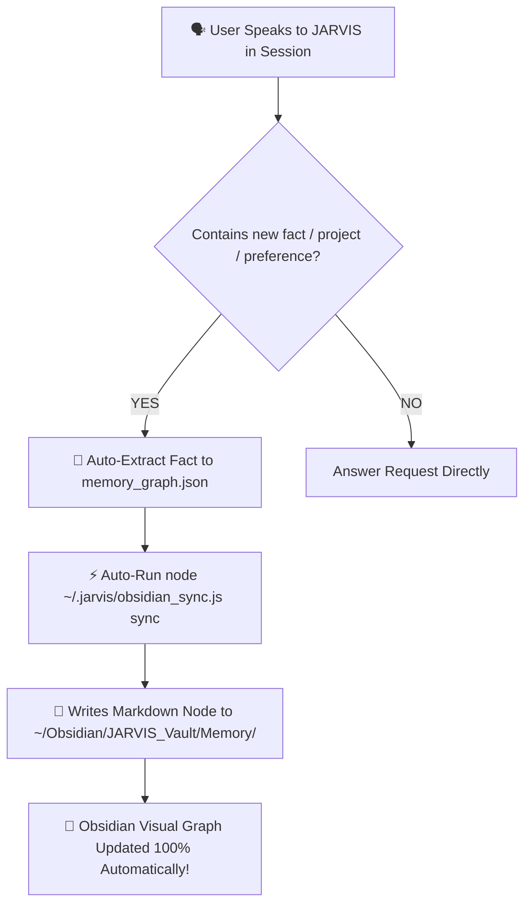

# 🤖 JARVIS System Manifest & Scaling Guide

Welcome to the master control document for **JARVIS** (Just A Rather Very Intelligent System), your personal AI executive assistant built on Antigravity (`agy`), Notion `Personal_OS`, Obsidian Vault, Warp Terminal, Raycast, and Apple Native macOS automation.

This document serves as the **living architecture blueprint**, **capability registry**, and **scaling guide** for extending JARVIS.

---

## 📌 Executive Summary & Architecture Overview (v19.0.0 Automatic Obsidian Memory Engine)

JARVIS operates on **AUTOMATIC SELF-EVOLVING MEMORY**:
1. **Automatic Background Knowledge Extraction (v19.0.0)**: **No manual effort required.** Every time you talk to JARVIS, it automatically extracts new entities, project details, and personal preferences, updates [`~/.jarvis/memory_graph.json`](file:///Users/sorpheatepy/.jarvis/memory_graph.json), and **automatically syncs markdown nodes into your Obsidian Vault** (`~/Obsidian/JARVIS_Vault/Memory/`).
2. **On-Demand Manual Dictation**: You can ALSO explicitly dictate notes anytime (*"Jarvis, create note..."*).
3. **Direct Notion Task Logger**: Add new tasks straight into Notion `Personal_OS` via voice or CLI (`jarvis add task <title>`).
4. **Notion Calendar Sync**: Uses Notion database date properties to map and speak daily calendar events.
5. **Morning Executive Briefing**: Multi-source morning update combining Phnom Penh weather, Notion schedule, and priority tasks (`jarvis good morning`).
6. **Spotify / Apple Music Media Control**: Hands-free focus music control (`jarvis play focus music`, `jarvis pause`).
7. **24/7 Solid Continuous Voice Listener**: Hands-free wake-word detection (`"Hey Jarvis"` / `"Goodbye Jarvis"`).

---

## 🧠 AUTOMATIC MEMORY WORKFLOW MATRIX (v19.0.0)

---

## 📝 Change Log & System Versioning

* **v19.0.0 (2026-08-10)**:
  * Deployed Automatic Background Knowledge Extraction & 100% Hands-Free Obsidian Vault Auto-Syncing.
* **v18.0.0 (2026-08-10)**:
  * Integrated Obsidian Vault Engine (`~/Obsidian/JARVIS_Vault`, `obsidian_sync.js`).
* **v1.0.0 (2026-08-10)**:
  * Initial JARVIS architecture deployed with Notion `Personal_OS` sync.
